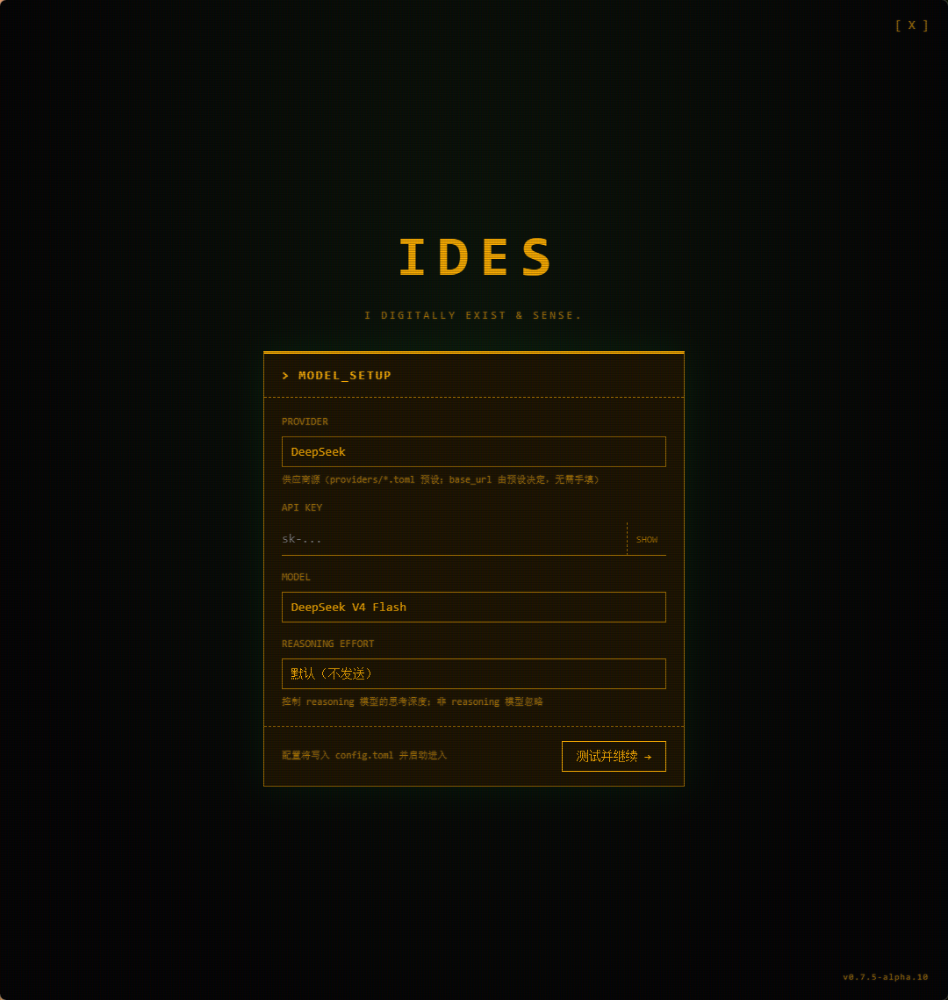
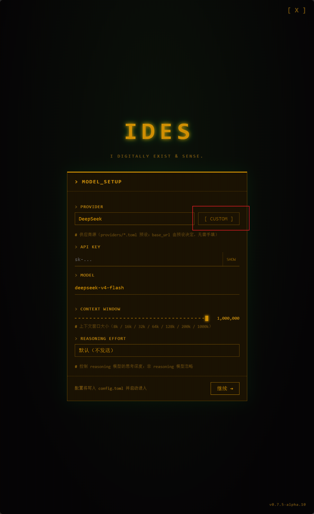
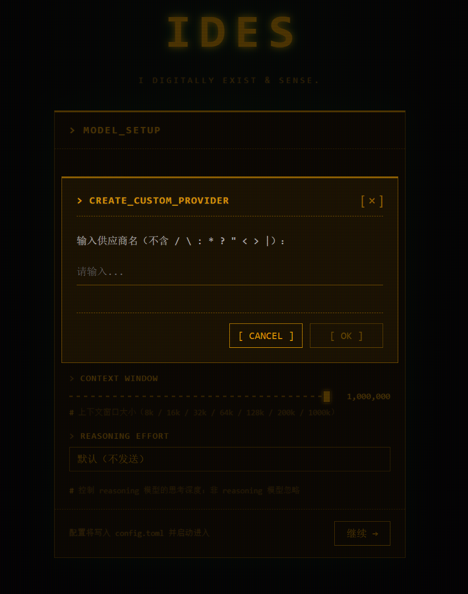

# Quick Start

Welcome to IDES — a Rust-native AI agent foundation built around memory.

This section walks you through getting your first IDES instance up and running from scratch: installing it, connecting a model provider, and starting a conversation.

## Install IDES

Download the installer for your platform from [GitHub Releases](https://github.com/kaluluosi/IDES/releases).

### Windows (NSIS)

Download `xxx-setup.exe` and run the installation wizard:

- **Standard install**: just click **Next** through the wizard to install to your local disk.
- **Portable mode**: tick **Portable mode** in the wizard to install IDES onto removable media such as a USB drive — carry it anywhere, plug in and go, and it runs on any computer.

### Linux (.deb)

Download `xxx_amd64.deb` and install it directly:

```bash
sudo dpkg -i ides_xxx_amd64.deb
```

!!! note "Platform support"
    We currently ship **Windows** (NSIS) and **Linux** (.deb) packages. A macOS build is available but not yet signed for distribution — stay tuned.


The first launch shows the IDES boot screen. Once startup finishes, you land in the main interface.

## Connect a model provider

IDES needs a model provider to power agent conversations.



1. Open **Settings** (the ⚙ icon in the top-right of the main interface).
2. In the **Connection** tab, pick a built-in provider.
3. Enter your API Key.
4. Choose the model you want to use.
5. Save and start a conversation.

!!! tip "Built-in providers"
    IDES ships with major providers built in (DeepSeek, OpenAI, and more). Just pick one, add your key, and you're good to go — no extra configuration needed.

!!! note "Supported API protocols"
    IDES currently supports only **OpenAI API–style** endpoints (`/v1/chat/completions`). It does **not** support other interfaces such as the response API. Before connecting any provider, make sure it offers an OpenAI-compatible endpoint.

## Custom providers

Model services beyond the built-in providers — private providers, enterprise gateways, local models like Ollama — can be connected as long as they expose an **OpenAI-compatible `/v1` endpoint**.

To set one up, create a new toml under the `providers/` directory in your IDES data folder (one toml = one provider). You can also open the provider selector on the Settings page and use the `[ CUSTOM ]` button to bring up the custom-provider creation panel (just enter the provider name).



After clicking `[ CUSTOM ]`, a dialog appears — simply enter the provider name (no special characters):



Take **Ollama local models** as an example:

1. Start Ollama and pull a model (e.g. `qwen2.5:7b`).
2. Open the `providers/` folder in your IDES data directory (Windows default: `%LOCALAPPDATA%\com.ides.desktop\providers\`; in portable mode it's in the same folder as the exe).
3. Create `ollama.toml` and fill in `base_url` and the model list **inside the file**, like this:

    ```toml
    name = "ollama"
    display_name = "Ollama"
    base_url = "http://localhost:11434/v1"

    [models]
    "qwen2.5:7b" = { display_name = "Qwen 2.5 7B", context_window = 32768, reasoning = false }
    ```

4. Restart IDES, select **Ollama** in Settings, enter an API Key (it's not validated locally, so any placeholder works), and choose the model.
5. Save and start a conversation.

!!! danger "base_url is required"
    `base_url` is mandatory. A provider config with an empty `base_url` is silently ignored — even if you create the toml, it won't show up in the provider list. Be sure to fill in an OpenAI-compatible root endpoint (e.g. `http://localhost:11434/v1`).

!!! tip "Provider preset format"
    `name` is the unique identifier, `display_name` is the name shown in the Settings UI, `base_url` points to the OpenAI-compatible root endpoint, and `[models]` lists the selectable models. Model names wrap the key in quotes (required when the key contains special characters like `:`).

!!! tip "OpenAI-compatible protocol"
    As long as a provider exposes an **OpenAI-compatible `/v1` endpoint**, you can connect it the same way — including self-hosted gateways and privately deployed model services.
