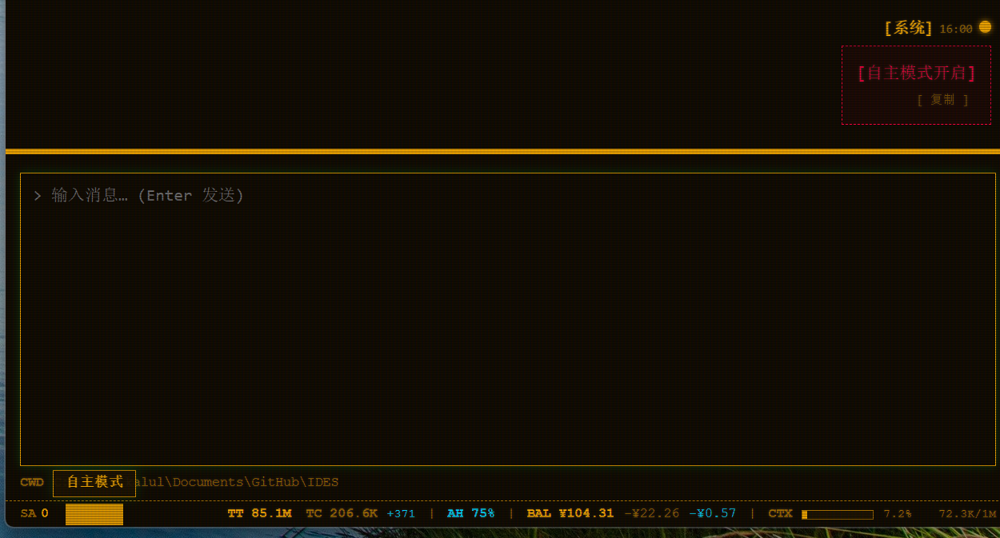

# 感知与通讯

!!! quote "主题句"
    **IDES 不是「你喊它才动」，而是「它自己听见了，会主动找你」。**

前面讲的都是「你主动用 IDES」——开箱即用的精装房、内置工具、甚至影分身，都是你**发起**。但 IDES 还有一个更进阶的能力：**感知与通讯**。

这一章讲 IDES 怎么「听见」外部世界、怎么主动回应你——不靠你每句话都来喊它。

!!! info "这一章讲什么"
    - **自主感知模式**：让 agent 从「被动等你喊」变成「主动感知外界」的开关。
    - **邮件系统**：IDES 内置的 agent 邮箱，收、读、发**真实邮件**。
    - **消息平台适配**：让 agent 接入微信、Telegram 等**即时通讯软件**，在外面也能跟你对话。

## 自主感知模式

用了 IDES 一段时间，你可能注意到：它更像一个**等你发话才动**的助手。而「自主感知模式」，是让你能选一个更进阶的用法——**让它自己听见外面的动静，主动来找你**。

### 开这个模式之前，agent 是「被动」的

不开的时候，agent 就是**你问它才答**。你想让它查邮件，得主动发消息让它查；你想让它看微信，也得主动告诉它。

### 开了之后，agent 会「主动」感知

开了自主感知模式，agent 就像**装上了一双耳朵**——它会自己去看看外面有没有新鲜事：

- **有没有新邮件**进了它的邮箱
- **有没有新消息**从微信、Telegram 那些平台进来

只要有，它就**主动醒过来**，替你处理。你不用每件事都亲自去喊它。

!!! warning "这个开关默认是关的"
    - **默认关闭**：IDES 不会替你做主，默认不轮询外界。你要用，得**自己开**。
    - **每次启动都要重开**：它不记你上次的开关状态——这样保证外部消息**不会悄悄**闯进 agent 的收件箱，除非你主动打开这扇门。

### 怎么打开

在 IDES 界面**打开这个开关**，agent 就进入「自主模式」。开启后，界面上方会显示 **`【自主模式开启】`**——



看到这个提示，就说明 agent 已经「听见」外界了，会主动去感知邮件、消息平台的新动静。

### 一句话

自主感知模式，就是给 agent **装上一双耳朵**。开了它，下面讲的邮件、消息平台才真正**活**起来。不开，它们就只是「躺着」，等你发话才动。

## 邮件系统

IDES 内置了一套邮件系统——agent 有自己**真正的邮箱**，能收、读、发**真实邮件**。IDES 相当于一个智能体邮箱客户端。

调用方式见 [内置工具 · mail](../builtin-tools/#mail)。

### 它是什么

普通人邮箱是**自己**的。IDES 这套邮箱是**给 agent 的**——它有自己的独立邮箱账户，能真正收发邮件，而不只是模拟一个收件箱。

你能用它做这些事：

| 你能做什么 | 说明 |
|-----------|------|
| **收件** | agent 能看到自己邮箱里有什么新邮件 |
| **读** | 打开看全文 |
| **发** | 用 agent 的身份发出去 |
| **管理** | 删、标记已读等 |

### 配合自主感知模式用

邮件系统**配合自主感知模式**才最有用：

- **不开自主感知**：agent 的邮箱是「躺着」的——你让它查，它才查。
- **开了自主感知**：agent 会**主动去看邮箱**，有新邮件就**自己醒过来处理**。

```python
# 让 agent 查看自己的邮箱，最近 10 封
mail(action="inbox", limit=10)
```

### 你会怎么用

配好 agent 的邮箱后，你就能**用邮件跟 agent 交流**。比如：

> 你在出差，发一封邮件给家里的 agent：「帮我把周报整理好发我」。它收到后，会**自己醒过来**，打开你的邮件，处理掉，再用邮件回你。

这也是为什么叫「感知与通讯」——**邮件是 agent 感知外界、主动回应你的一条路**。

!!! warning "安全性提醒"
    你可以配置自己的**私人邮箱**，让 agent 帮你整理邮箱。但**请慎重使用自主感知模式**——因为不保证**恶意邮件里夹带的指令**会不会引导 agent 犯错。将来 IDES 会考虑增设一个开关，**只让白名单里的邮箱账户**能够自主感知。

## 消息平台适配

邮件的「通讯」是发邮件。而消息平台适配，是用**即时通讯软件**（微信、Telegram、元宝……）跟 agent 对话——你在外面，也能随时找到它。

channel 的核心机制见 [强袭挂件 · channel](../equipment/#channel)。

### 微信 ClawBot

**微信 ClawBot** 能带你接入**个人微信**——用个人微信扫一下二维码，agent 就能在微信上跟你对话。你平时怎么用微信，就怎么跟你的 agent 聊。

它是一个标准适配器（即插即用），源码开源在 GitHub：<https://github.com/kaluluosi/ides_adapter_weixin>

接微信一共三步，**你不需要自己配 MCP**——发个信息给 agent，它会搞定。

#### 第一步：把配置发给 agent

把下面的配置（或上面的 GitHub 链接）**发给你的 agent**，它自己会注册这个适配器 MCP：

```toml
name = "weixin"
transport = "stdio"
command = "uvx"
args = ["ides-adapter-weixin"]
enabled = true
exclude = []

[env]
WEIXIN_ACCOUNT_ID = "default"
```

你不用去动配置文件，agent 会自动帮你接好。

!!! tip "想接几条微信"
    `WEIXIN_ACCOUNT_ID` 给每条微信起个名字。默认 `default`，想接**多条微信**就改这个值，每条一个账户。

#### 第二步：agent 会让你扫码绑定

注册好后，agent 会让你**扫码绑定**你的个人微信：

```
agent 发起接入
 → 屏幕上出现二维码
 → 你用个人微信扫一下
 → 确认登录
 → 你的微信跟 agent 绑上了
```

#### 第三步：让 agent 给微信发条消息

绑定好之后，**开启自主感知模式**，让 agent 给微信 ClawBot 发一条消息——它就能在微信上跟你对话了。

#### 它能做什么

接上之后，你在微信里发消息，它就能收到、回复。就跟你在微信里加了个「AI 好友」，随时找它帮你办事。

!!! note "ClawBot 接的是个人微信"
    ClawBot 接的是**个人微信**（扫二维码登录）。**企业微信**（WeCom）是另一回事——它的群机器人只能**发**，要双向得用「企业微信（应用）」。别混。

### 自定义平台适配

看到「接入个人微信」，你可能想：那我如果想把 agent 接到**别的平台**（Telegram、元宝、甚至自家 App）呢？

答案很简单——**IDES 不用每个平台都单独做一套**。它用一套统一的接入方式（channel），你只需要**照着给新平台写个连接器**，就能把它接进来。

#### 先看这个示范项目

想把 agent 接到任何平台，最好的起点是看 **`ides_adapter_weixin`** 这个项目——它**就是平台适配器的示范项目（范本）**：

<https://github.com/kaluluosi/ides_adapter_weixin>

这个微信适配器看着是「某个特定平台」，但它其实演示了一套**通用的接入方式**——你照着它的样子，就能接别的任意平台。

#### 参考它，接你的平台

- IDES **不用**为微信专门做一套、为 Telegram 再做一套
- **任何平台**都能用**同一套接入方式**接进来
- `ides_adapter_weixin` 就是这套方式的**一个现成范本**——看它怎么接，你就知道怎么接别的平台

核心就一句话：**一个平台，写个连接器，就能接进 IDES。** 微信是照这个范本做的，别的平台也是。
