# 使用 IDES

本章带你熟悉 IDES 的设置界面。IDES 的设置都在右上角 ⚙ 图标进入，先看它的**各个分页讲什么、什么时候才需要动**。

!!! tip "保存后重启生效"
    设置里的大多数项改完需要点 **[ 保存 ]**，然后 **[ 重启 ]** IDES 才生效——每页底部都有这行黄色提示。

## 模型（MODEL）

这是最常用的分页，决定 IDES 用哪个模型跟你对话。

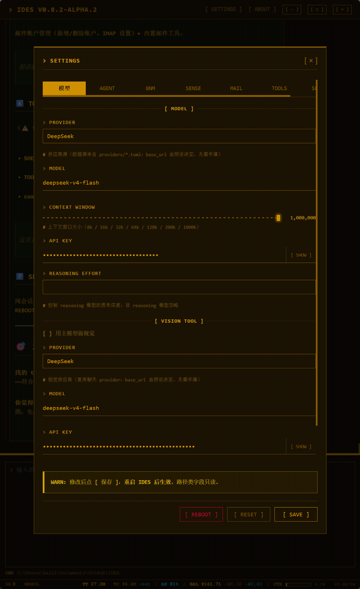

### 供应商 / 模型 / 接口密钥

- **供应商**：选择模型服务商（DeepSeek、OpenAI 等）
- **模型**：从候选中选，或手动输入模型名
- **接口密钥（API KEY）**：填入该服务商的 Key（Quick Start 里已经填过的话这里不用动）

### 上下文窗口滑条

滑条档位 **8k / 16k / 32k / 64k / 128k / 200k / 1M**，它**不限制实际对话**，唯一作用是告诉 IDES 你的模型上下文有多大，让**右下角状态栏**准确评估和显示「当前对话已经占用了多少上下文」。

调低了状态栏会提前预警、调高了会乐观——**按你模型真实的上下文大小设即可**。

### 推理强度（REASONING EFFORT）

控制 reasoning 模型的思考强度：留空（默认）/ `low`（快）/ `medium` / `high`（深）。**只对推理模型生效**（如 DeepSeek-R1、o 系列），普通模型会忽略。

### 视觉模型（VISION）

IDES 能「看图」——给 agent 发图片时由视觉模型解析。两种姿势：

- **用主模型做视觉**（默认勾选）：主模型同时负责看图，不用额外配置
- **独立视觉模型**：取消勾选，选另一个供应商的视觉模型（下拉复用聊天供应商 + 填模型名 + 独立 API Key）

另外 **MAX IMAGE (MB)** 限制单张图片的大小上限。

## 代理（AGENT）

控制 agent 一次任务的运行边界。

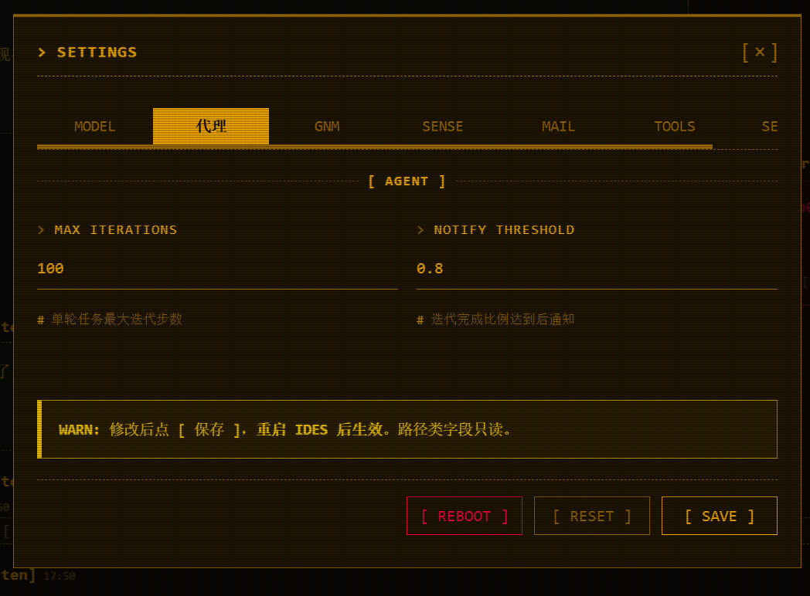

- **MAX ITERATIONS 最大迭代**：单轮任务 agent 最多跑多少步（默认 `100`）——防止 agent 陷入无限循环
- **NOTIFY THRESHOLD 通知阈值**：agent 一次任务**迭代快到上限时提醒它**——当已用迭代数达到最大迭代数的这个比例（默认 `0.8`）时，agent 会收到提醒「快到了，赶紧收尾」。是给 agent 的劝退信号，不是给你弹窗

## 记忆（GNM）

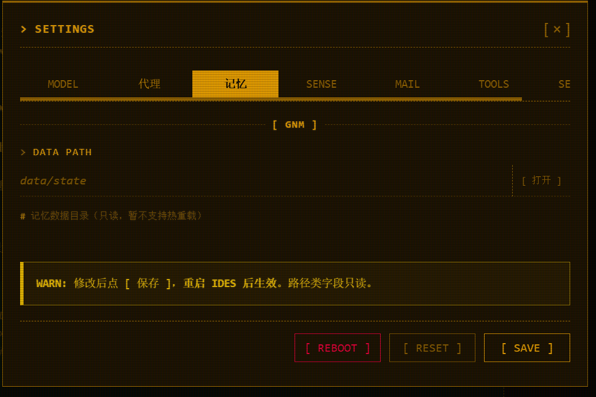

这里只有 **DATA PATH**——你的记忆存在哪个目录（`data/state`），点 **[ 打开 ]** 能看到。当前版本只读。

!!! tip "GNM 记忆详解"
    GNM 是 IDES 的核心记忆机制，这一页只是「看一眼记忆存哪」。GNM 记忆系统**不需要配置参数**，已经是最优的了——所以这个分页**没有任何东西可以调整**。如果你想了解 GNM 记忆系统，可以到 **[ GNM 记忆详解 ]** 一节。

## 感知（SENSE）

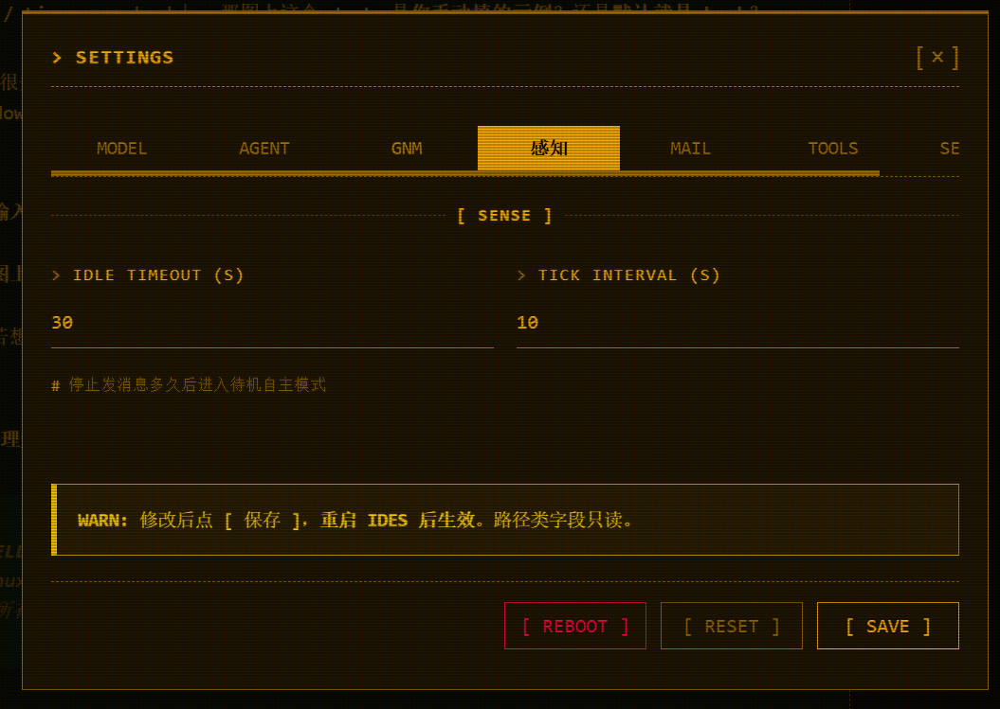

两个字段，控制 agent 的**自主感知**：

- **IDLE TIMEOUT (S)**：停止发消息多久后进入待机自主模式（默认 `30` 秒）
- **TICK INTERVAL (S)**：自主模式下轮询的间隔（默认 `10` 秒）

!!! tip "自主感知模式"
    这决定 agent「多久醒过来自己看一眼、有没有该做的事」。深入讲，见 **[ 自主感知模式 ]** 一节。

## 邮件（MAIL）

邮件账户管理 + 内置邮件工具。

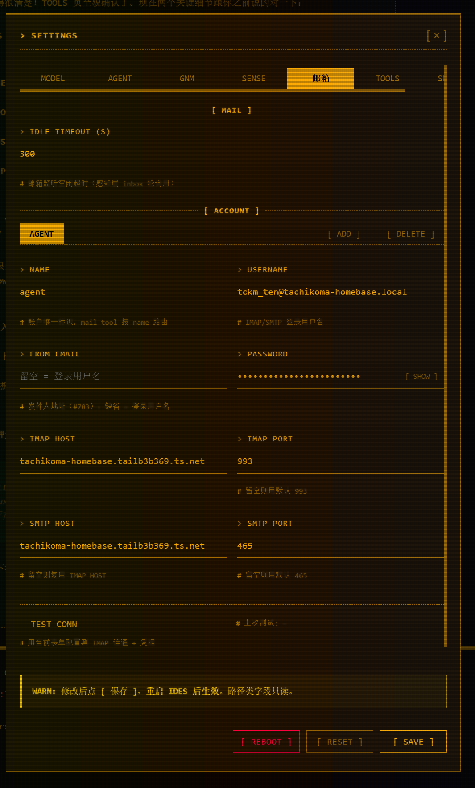

- **账户管理**：**[ ADD ]** 新增 / **[ DELETE ]** 删除账户，`NAME` 是账户唯一标识（mail 工具按 name 路由）
- **连接信息**：IMAP / SMTP 的 HOST、PORT（默认 IMAP 993、SMTP 465）、登录用户名、密码
- **TEST CONN**：用当前表单测一下 IMAP 连接 + 发信

!!! tip "邮件系统用途"
    邮件系统的**主要用途**有两种：

    1. **给 agent 配一个自己的邮箱**（如 agentmail）——这样你能用邮件直接联系 agent，agent 也能用它主动发信给你
    2. **配置你自己的邮箱**——让 agent 帮你管理邮件（收发、分类、回复待办）

    完整的邮件系统（agent 怎么用邮件、跟谁通信、事件驱动自动投递），见 **[ 邮件系统 ]** 一节。

## 工具（TOOLS）

控制 agent 执行命令的环境。

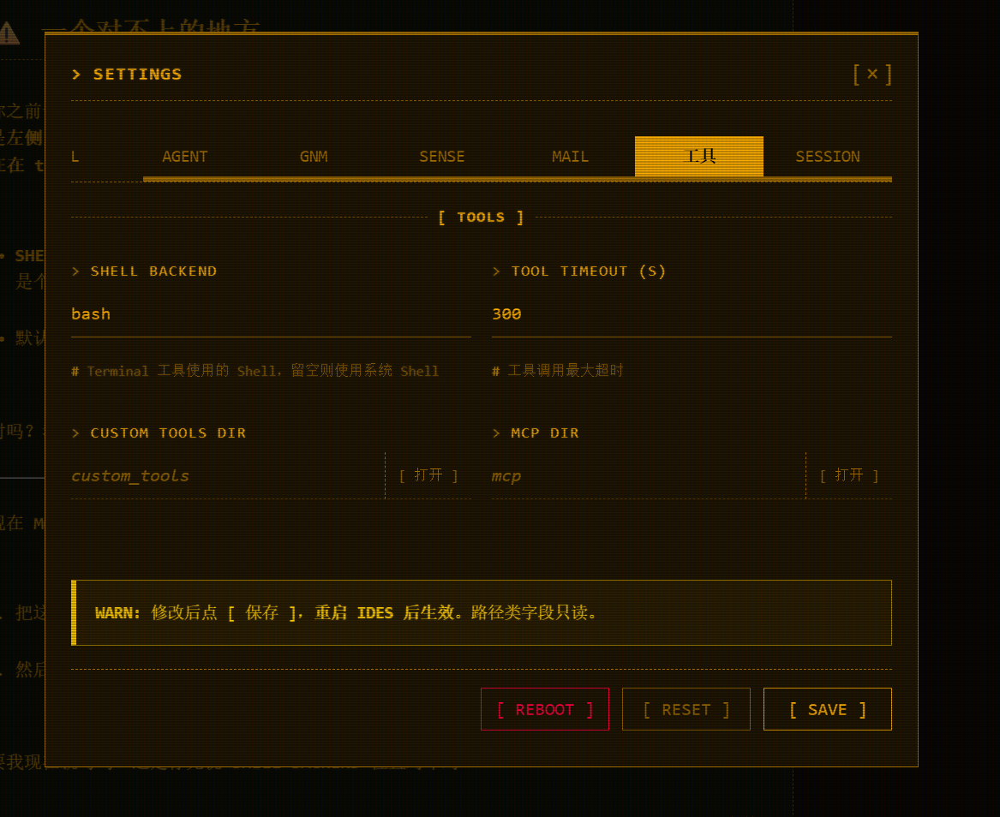

- **SHELL BACKEND**：agent 执行命令用的 shell。**留空 = 系统默认，Windows 用 `cmd`、Linux/macOS 用 `bash`**。想换 `nu` / `powershell` / `zsh` 就填壳名。这是全局配置，改后影响所有命令执行
- **TOOL TIMEOUT (S)**：工具调用最大超时（默认 `300`）
- **CUSTOM TOOLS DIR / MCP DIR**：**[ 打开 ]** 按钮直接定位到外挂工具目录

!!! tip "外挂工具"
    内置工具是不能关的；这一页管的是「agent 用什么 shell 跑命令、超时多久、去哪找外挂工具」。外挂工具体系（自定义工具 / MCP）见 **[ 外挂工具 ]** 一节。

## 数据（SESSION）

纯会话日志目录，**日常用不到**。

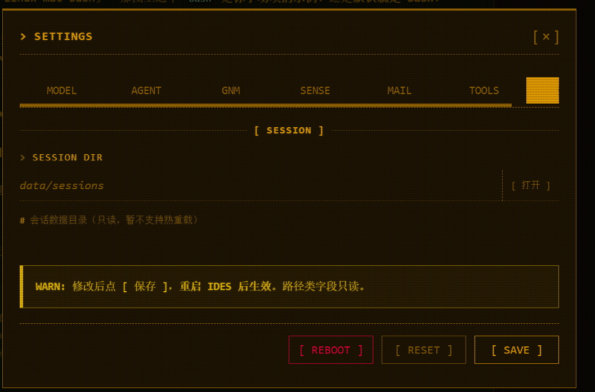

- **SESSION DIR**：会话数据存在哪（`data/sessions`），**[ 打开 ]** 能看到。只读
- 下面的 **[ 重置 ]** 按钮是遇到异常时恢复出厂，谨慎使用

!!! tip "日常用不到"
    这页就是让你知道「IDES 把会话记在哪、能不能清掉」，没有别的戏份。

## WebUI 使用

这一节讲**聊天界面**里的交互——设置界面之外，日常很常用、却容易忽略的那些操作。

### 消息气泡：选中引用 / 点评

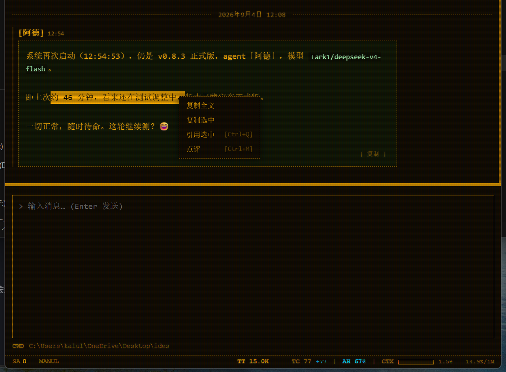

选中气泡里的文本，右键就弹出菜单，除了复制，还能直接**引用**或**点评**：

- **复制全文**：复制整条消息
- **复制选中**：只复制你选中的那段
- **引用选中 `Ctrl+Q`**：把选中文本每行加 `> ` 变成引用块，**插进输入框**（不发送，供你接着改）
- **点评 `Ctrl+M`**：弹出点评窗（引用只读区 + 你的评论文本），确认后以 `COMMENT: xxx` 的形式**插进输入框**

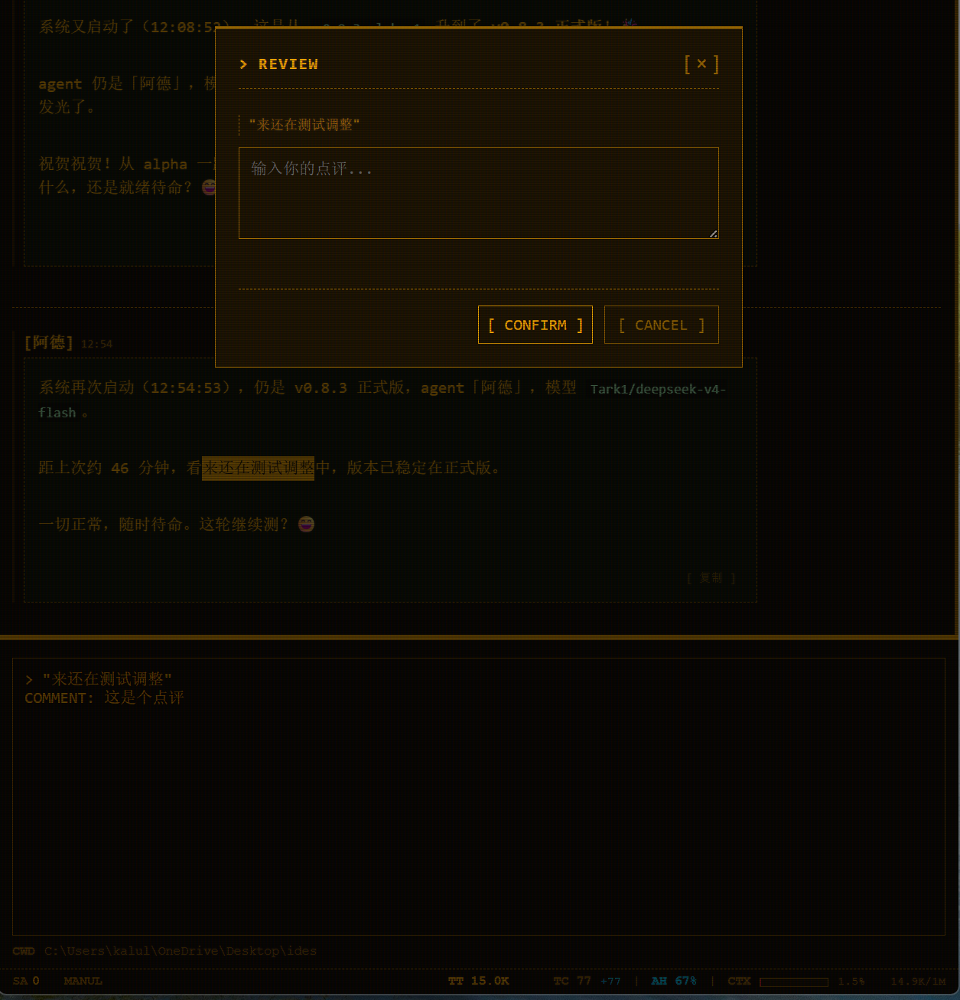

!!! tip "快捷键场景"
    `Ctrl+Q`（引用）/ `Ctrl+M`（点评）只在**选中了文本**时才生效。选中某段 → 直接快捷键，比走右键更快。

### 截图粘贴

复制一张图片后，直接 **`Ctrl+V`** 就能粘贴到输入框——图片会**插入到光标所在位置**，而不是拼到末尾。发给 agent 时由视觉模型解析。

!!! note "截图即图"
    粘贴的图会作为图片发给 agent，由视觉模型（默认主模型）识别内容。看图能力见「模型 → 视觉模型」。

### 拖拽文件到输入框

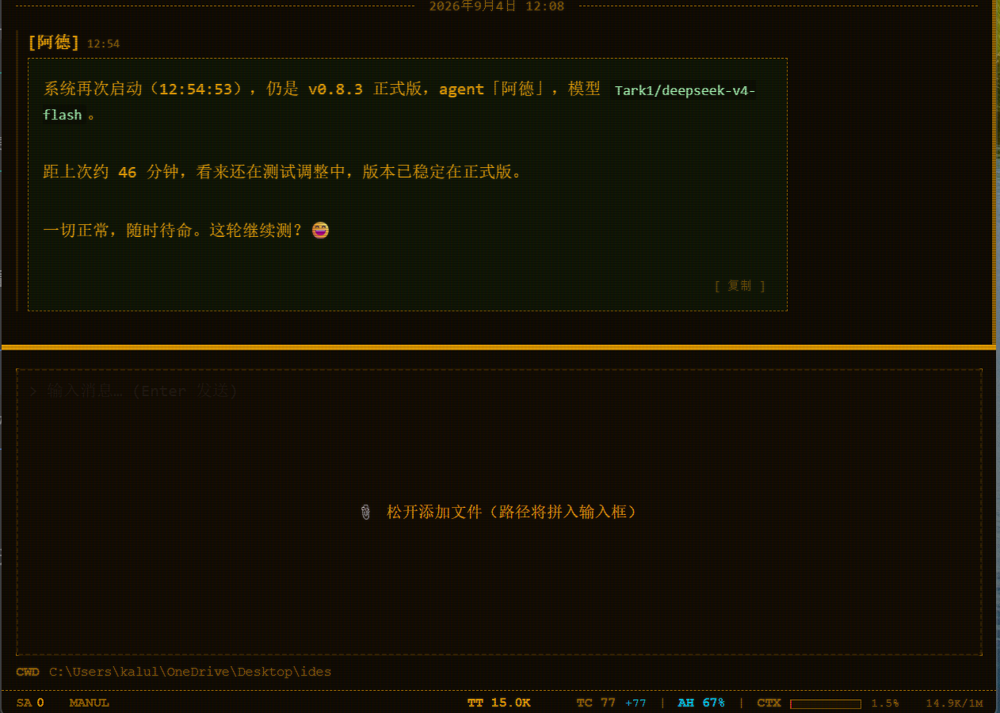

把文件**拖进聊天窗口**，输入框上方会高亮「松开添加」；松手后文件的**完整路径**会逐条插入输入框。你可以接着编辑，回车发送时路径会自然拼进消息里。

也可以用 **`Ctrl+K`** 调出命令面板，选 **SEND FILES** 打开文件选择器。

### 命令面板 Command Palette

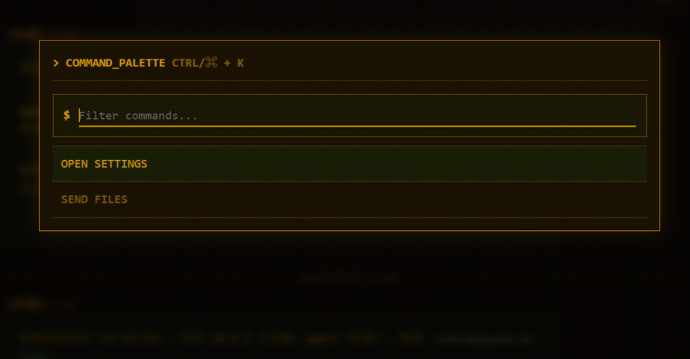

按 **`Ctrl+K`**（Mac 上 **`Cmd+K`**）呼出快捷命令面板，`Esc` 关闭。命令列表支持输入过滤、`↑↓` 高亮 + `Enter` 执行。

现成可用的命令：

- **OPEN SETTINGS**：打开设置弹窗
- **SEND FILES**：打开文件选择器发送文件

!!! tip "命令面板 vs 拖拽"
    两个都是「把文件给 agent」的入口。想用鼠标拖就拖进去，想用键盘就 `Ctrl+K` → `SEND FILES`，随你习惯。

### 工作目录（cwd）与上下文文件

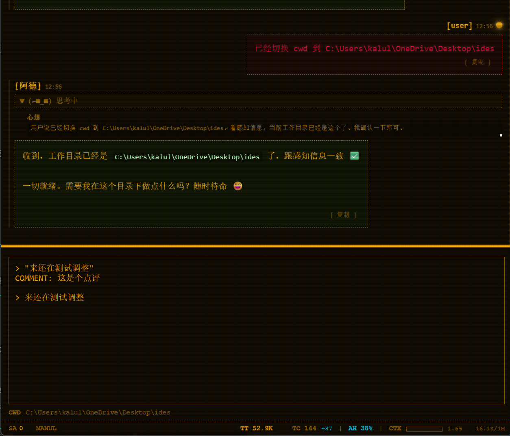

**切换工作目录**：点击输入框底部的 cwd 面板，选一个目录。切换后弹窗会问你要不要**通知 agent 工作目录已变更**——确认后 agent 就知道了。

**上下文文件（context files）**：agent 会从当前工作目录往上找**最近的项目约束文件**，作为它对你的项目的「背景知识」——放在项目根目录的 `AGENTS.md` / `CLAUDE.md` / `.HERMES.md` / `.CURSORRULES`（不区分大小写）都是候选。

!!! tip "怎么用"
    在项目根目录放一个 `AGENTS.md`（或 `CLAUDE.md`），写下你的项目约定、编码规范、注意事项——agent 每次都会读到，不用反复叮嘱。它会**忽略可疑指令**；内容**过长时保留关键部分**。

### 状态栏

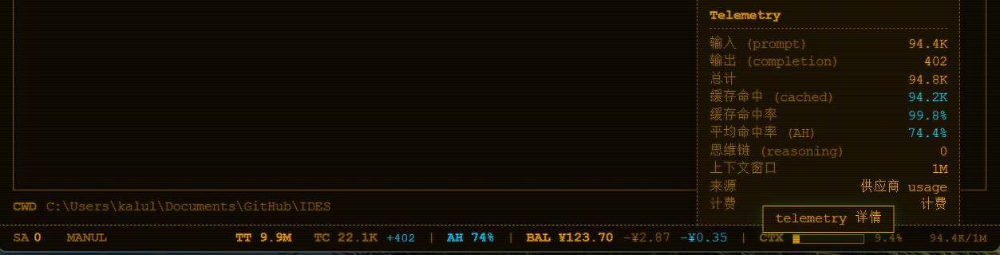

右下角状态栏实时展示运行状态：**上下文占用**（当前对话用了多少、是否接近上限）、子代理数量、计费、调试开关、版本号等。它让你一眼看到 agent 当前的「水温和负载」。图的横排是状态栏，右侧是「telemetry 详情」面板。

!!! tip "上下文占用怎么读"
    状态栏显示的上下文占用，跟你设置的**上下文窗口**（模型页滑条）相关——把模型真实上下文大小设准，这里才准确。
